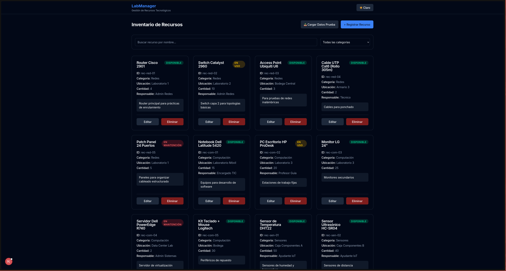
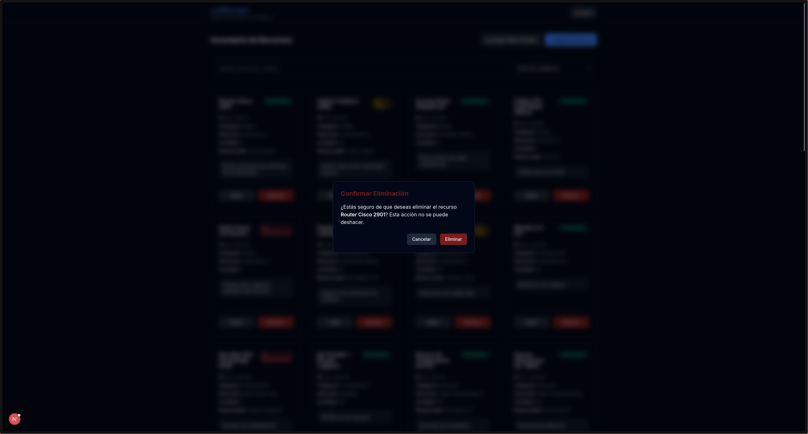
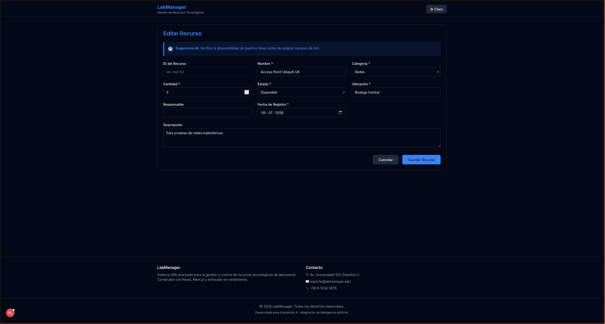
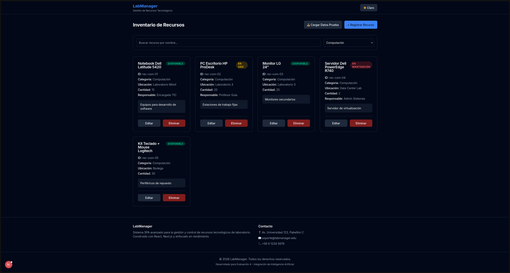
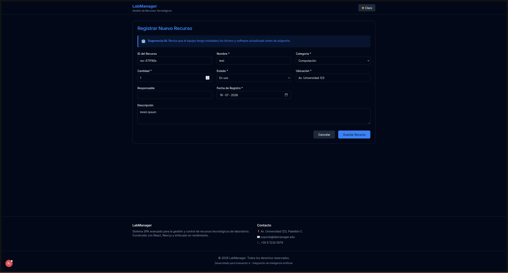

# LabManager - Sistema de Gestión de Recursos Tecnológicos

Aplicación web tipo SPA (Single Page Application) desarrollada para administrar y controlar los recursos tecnológicos de un laboratorio, reemplazando el registro manual para evitar la pérdida de información y la duplicidad de datos.

## Integrante
- Pedro Lorca

## Objetivo
El propósito de esta aplicación es proveer una interfaz moderna, rápida y centralizada que permita a los administradores de un laboratorio realizar un seguimiento preciso del inventario tecnológico. Permite registrar, editar, visualizar y eliminar recursos (CRUD), manteniendo la información guardada localmente sin necesidad de una base de datos externa.

## Tecnologías utilizadas
- **Framework:** Next.js (App Router) y React
- **Lenguaje:** TypeScript
- **Estilos:** Tailwind CSS (v4)
- **Almacenamiento del navegador:** Local Storage, Session Storage y Cookies

## Instalación y ejecución

Sigue estos pasos para ejecutar el proyecto en tu máquina local:

1. Clona el repositorio:
   ```bash
   git clone https://github.com/hideonn1/Evaluaci-nN4-frontend.git
   cd evaluacion4-frontend
   ```

2. Instala las dependencias:
   ```bash
   npm install
   ```

3. Ejecuta el servidor de desarrollo:
   ```bash
   npm run dev
   ```

4. Abre tu navegador en [http://localhost:3000](http://localhost:3000)

## Estructura de carpetas
- `src/app`: Contiene las rutas principales de Next.js (`page.tsx`, `layout.tsx`) y los estilos globales (`globals.css`).
- `src/components`: Componentes visuales y de interfaz de usuario reutilizables (ej. tarjetas, botones, formularios).
- `src/hooks`: Hooks personalizados creados para interactuar con las APIs de almacenamiento del navegador.
- `src/types`: Definiciones de interfaces y tipos estrictos de TypeScript (ej. la interfaz `Resource`).
- `src/utils`: Funciones utilitarias como reglas de validación (`validations.ts`) y datos simulados (`mockData.ts`).

## Componentes principales
- **`Header` y `Footer`**: Componentes estructurales que brindan navegación, contexto de la aplicación y el botón de cambio de tema.
- **`ThemeToggle`**: Botón encargado de inyectar las clases CSS para alternar entre modo oscuro y claro.
- **`ResourceForm`**: Formulario interactivo reutilizado tanto para crear nuevos recursos como para editar los existentes.
- **`ResourceList`**: Grilla responsiva encargada de mapear el arreglo de recursos y renderizar las tarjetas.
- **`ResourceCard`**: Tarjeta individual que muestra toda la información de un recurso en específico y provee los botones de acción (Editar/Eliminar).
- **`SearchBar` y `FilterCategory`**: Controles de formulario que permiten al usuario filtrar la lista visualizada en tiempo real.
- **`ConfirmDeleteModal`**: Modal emergente y accesible que pide confirmación antes de eliminar permanentemente un recurso.

## Hooks utilizados
### Hooks nativos de React
- **`useState`**: Se utiliza para manejar estados locales como la apertura de modales, el estado de los campos del formulario y los errores de validación.
- **`useEffect`**: Utilizado para sincronizar efectos secundarios, como la aplicación de la clase `.dark` en el DOM o resetear estados al cargar datos iniciales.
- **`useMemo`**: Optimiza el rendimiento evitando recalcular los filtros de búsqueda en la lista de recursos a menos que los datos originales o el término de búsqueda cambien.
- **`useCallback`**: Memoiza funciones (como las de guardado en el Storage) para evitar re-renderizados innecesarios en componentes hijos.

### Hooks personalizados
- **`useLocalStorage`**: Se encarga de sincronizar un estado de React con el `localStorage` del navegador.
- **`useSessionStorage`**: Sincroniza un estado de React con el `sessionStorage`.
- **`useCookie`**: Sincroniza un valor específico parseando y escribiendo en `document.cookie`.

## Persistencia de datos
El almacenamiento en el navegador se separó según el ciclo de vida deseado para la información:
- **Local Storage (`lab_resources`)**: Aquí se guarda el inventario completo (el arreglo de recursos). Como es Local Storage, los datos persisten aunque se cierre el navegador o se apague el computador, garantizando que el CRUD no se pierda.
- **Session Storage (`lab_resource_search` y `lab_resource_filter`)**: Se guarda el texto de la barra de búsqueda y el filtro de categoría activo. Esto permite que si el usuario recarga la página por accidente, no pierda su búsqueda, pero si cierra la pestaña, el filtro se limpie para una futura sesión nueva.
- **Cookies (`lab_theme`)**: Se guarda la preferencia del usuario sobre el modo oscuro o claro. Al usar una cookie, esta preferencia se puede leer tempranamente durante la carga de la página para evitar destellos visuales (FOUC).

## Validaciones
El formulario de recursos está protegido por el archivo `validations.ts`. Antes de guardar, se verifica que:
- Los campos de texto como **Nombre, ID, Ubicación, Estado y Fecha** no estén vacíos o contengan solo espacios.
- Se haya seleccionado una **Categoría**.
- El campo **Cantidad** sea obligatoriamente un número válido, y que sea mayor o igual a 0 (no se permiten números negativos).
Si alguna de estas condiciones falla, el formulario intercepta el envío (no se guarda en Local Storage) y muestra un mensaje de alerta en color rojo justo debajo del campo problemático.

## Uso de IA
Se utilizaron asistentes de Inteligencia Artificial (LLMs) como Gemini 3.1 Pro y Claude Sonnet 4.6 durante el desarrollo para:
- Definir la estructura arquitectónica inicial de componentes y custom hooks en Next.js.
- Generar rápidamente la extensa lista de datos de prueba estructurados (`mockData`).
- Asistir en la refactorización profunda de estilos CSS tradicionales hacia clases utilitarias y responsivas con **Tailwind CSS**.
- Auditar el código en busca de posibles bugs (ej. problemas de hidratación, type casting) y problemas de accesibilidad (aria-labels, manejo de foco en modales).
*(Adicionalmente, el formulario incluye una pequeña funcionalidad donde simula dar una "Sugerencia generada por IA" dependiendo de la categoría que se esté seleccionando).*

## Capturas de pantalla






## Conclusiones
El desarrollo de este proyecto demostró la importancia de separar las responsabilidades dentro del ecosistema React. La construcción de componentes reutilizables y la delegación de la lógica de almacenamiento a *Custom Hooks* permitió mantener el código de la vista (`page.tsx`) limpio y enfocado únicamente en la orquestación. Además, comprender las diferencias de alcance (scope) entre `LocalStorage`, `SessionStorage` y `Cookies` resultó fundamental para diseñar una experiencia de usuario sólida donde cada dato persiste exactamente el tiempo que debe hacerlo, logrando una SPA altamente funcional sin depender de una base de datos backend tradicional.
